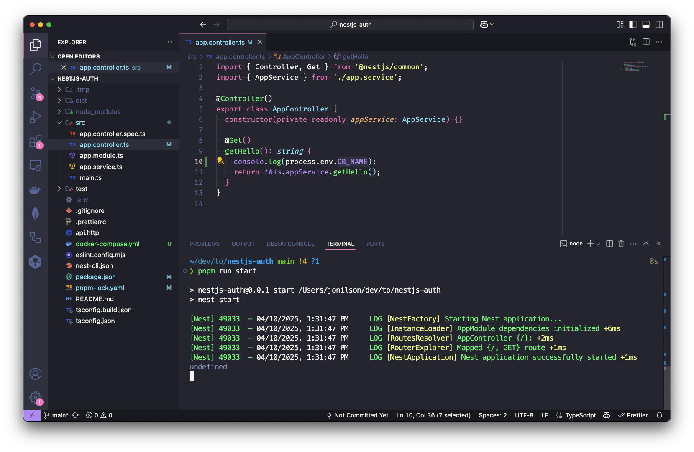
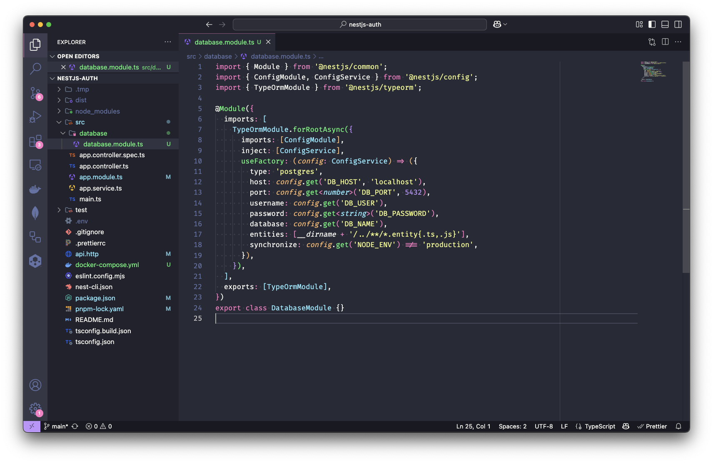
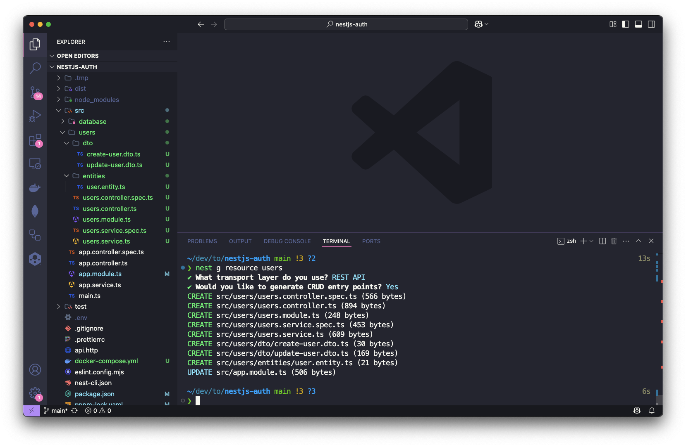
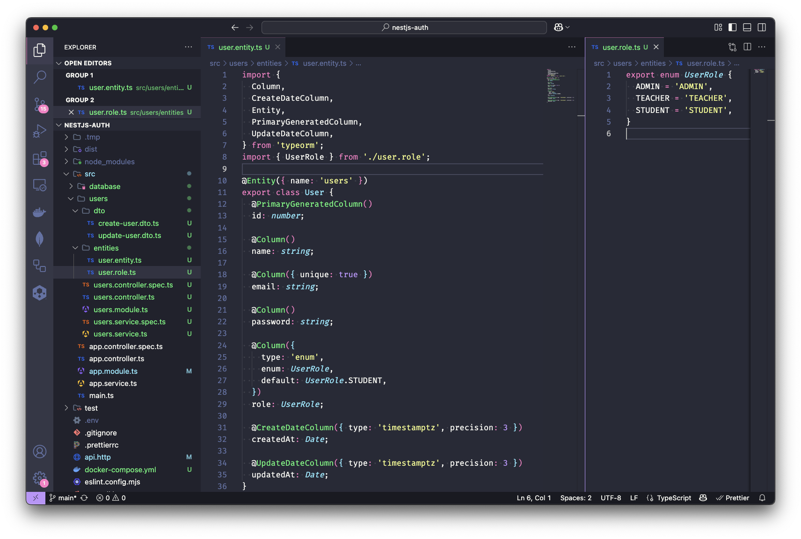
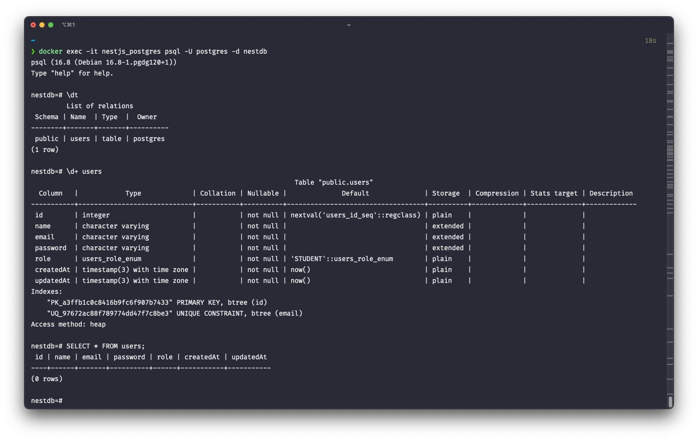
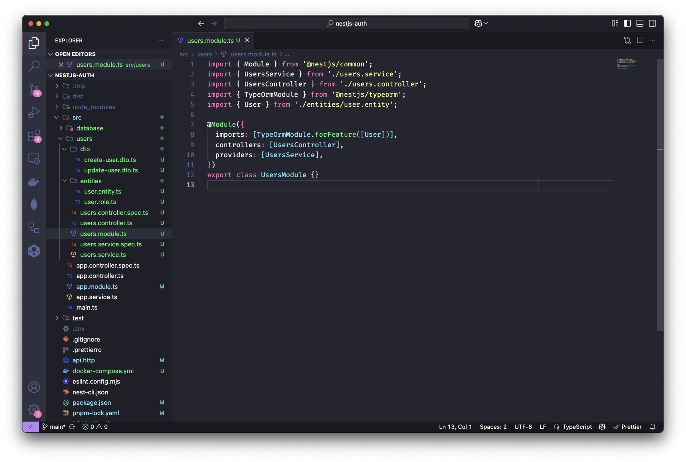
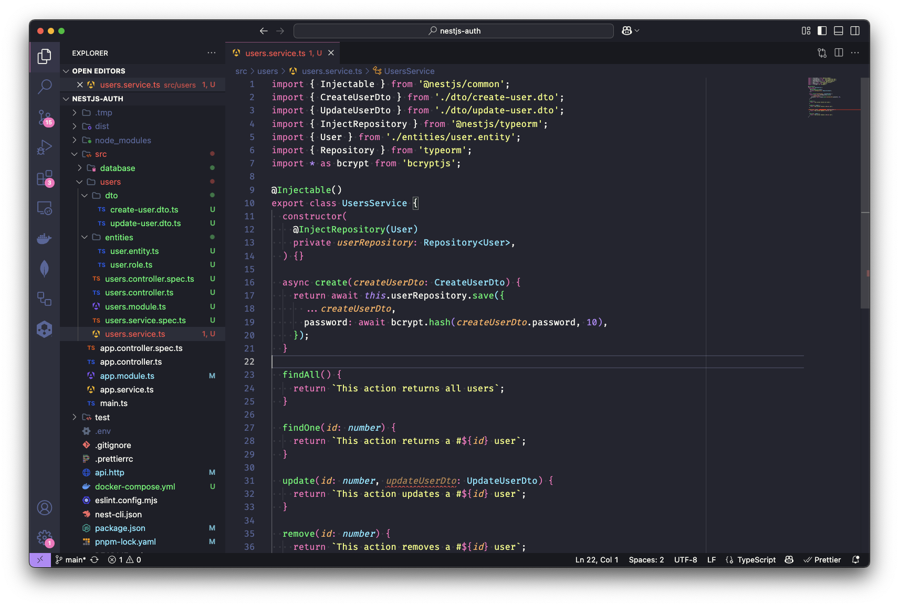
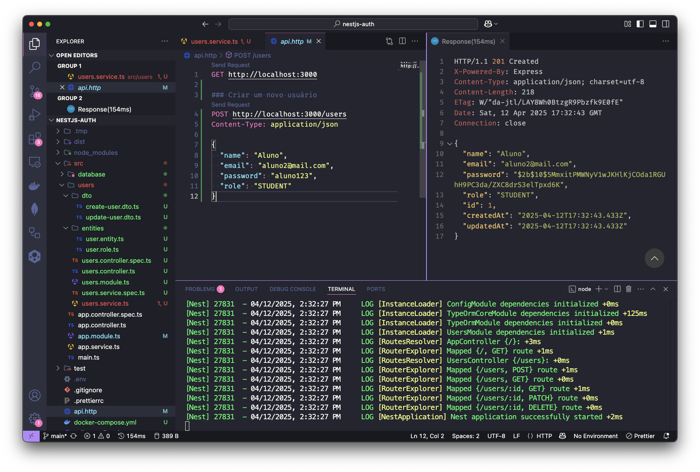
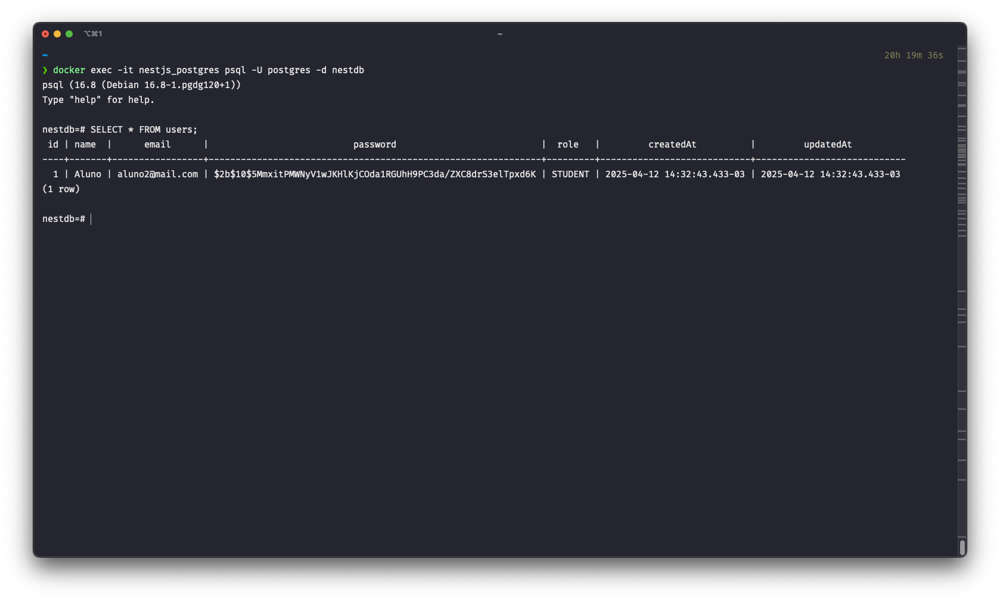

# NestJS: Autenticação e autorização com JWT

Vamos dar continuidade a nossa série de artigos dominando o NestJS. Neste artigo, vamos aprender a implementar autenticação e autorização com JWT (JSON Web Token) no projeto que iniciamos no [artigo anterior](https://dev.to/jonilsonds9/introducao-ao-nestjs-criando-sua-primeira-aplicacao-1plh). Vamos adicionar gerenciamento de usuários, onde os usuários podem se cadastrar e fazer login.

## Pré-requisitos

Você deve o projeto inicial do [artigo anterior](https://dev.to/jonilsonds9/introducao-ao-nestjs-criando-sua-primeira-aplicacao-1plh) para acompanhar o artigo. Caso não tenha feito isso, recomendo que você faça isso antes de continuar.

## O que é JWT?

JWT (JSON Web Token) é um padrão aberto (RFC 7519) que define um formato compacto e autônomo para transmitir informações entre partes como um objeto JSON. Dessa forma, um JWT contém todas as informações necessárias, o que evita uma consulta ao banco de dados.Assim, como o destinatário não precisa consultar o banco de dados para verificar a autenticidade do token.

As informações podem ser verificadas e confiáveis porque são assinadas digitalmente. O JWT pode ser assinado usando um algoritmo secreto (com o `HMAC`) ou um par de chaves pública/privada usando RSA ou ECDSA.

Um token JWT é composto por três partes:

- **Header** (Cabeçalho): O cabeçalho geralmente consiste em dois partes: o tipo do token, que é `JWT`, e o algoritmo de assinatura, como `HMAC`, `SHA256` ou `RSA`.

- **Payload** (Conjunto de declarações): Contém declarações de segurança verificáveis, como identidade do usuário, permissões, data de expiração, entre outras. 

- **Signature** (Assinatura): Usada para validar que o token é confiável e não foi adulterado. Para criar a assinatura, você deve ter o `header` e `payload` codificado em Base64Url, junto com a chave secreta e tudo assinado pelo algoritmo especificado no `header`.

## Como podemos usar o JWT?

O JWT pode ser usado de três maneiras:

- Autenticação: O JWT é usado para autenticar o usuário. Após o login, o servidor gera um token e o envia ao cliente. O cliente armazena esse token e o envia em cada solicitação subsequente para acessar recursos protegidos.

- Autorização: O JWT pode ser usado para autorizar o acesso a recursos específicos. O servidor pode verificar as permissões do usuário com base nas informações contidas no token.

- Troca de informações: O JWT pode ser usado para transmitir informações entre partes. Como o JWT é assinado, as partes podem ter certeza de que as informações não foram alteradas.

## Antes de ir pro código...

Antes de começarmos a implementar a autenticação e autorização com JWT no nosso projeto NestJS. Precisamos de um banco de dados para armazenar os usuários. Para isso vamos usar o PostgreSQL, mas você pode usar qualquer banco de dados que preferir. Também vamos usar o TypeORM para facilitar a interação com o banco de dados.

### PostgreSQL com Docker Compose

Para facilitar o desenvolvimento, vamos usar o PostgreSQL no Docker. Para isso vamos precisar do Docker instalado na sua máquina. Caso não tenha o Docker instalado, você pode usar a [documentação oficial](https://docs.docker.com/engine/install/) para instalar. 

Com o Docker instalado, crie um arquivo `docker-compose.yml` na raiz do seu projeto com o seguinte conteúdo:
```yaml
services:
  postgres:
    image: postgres:16
    container_name: nestjs_postgres
    environment:
      TZ: 'America/Sao_Paulo'
      POSTGRES_USER: ${DB_USER}
      POSTGRES_PASSWORD: ${DB_PASSWORD}
      POSTGRES_DB: ${DB_NAME}
    ports:
      - "5432:5432"
    volumes:
      - .tmp/database:/var/lib/postgresql/data
```

Certo, de forma proposital eu deixei variáveis de ambiente `DB_USER`, `DB_PASSWORD` e `DB_NAME` em vez de valores fixos. Isso é uma boa prática, pois permite que você altere esses valores sem precisar modificar o código. Além disso, você pode usar diferentes valores para diferentes ambientes (desenvolvimento, teste, produção, etc.).

Agora você pode criar um arquivo `.env` na raiz do seu projeto para adicionar as variáveis de ambiente para o Docker Compose bem como para o NestJS. Inicialmente, o arquivo `.env` deve conter as seguintes variáveis que precisamos para o Docker Compose:
```dotenv
DB_USER=postgres
DB_PASSWORD=postgres
DB_NAME=nestdb
```

Agora você pode iniciar o PostgreSQL com o Docker Compose. Execute o seguinte comando na raiz do seu projeto:
```shell
docker-compose up -d
```
Isso irá iniciar o PostgreSQL em segundo plano. Você pode verificar se o contêiner está em execução com o seguinte comando:
```shell
docker ps
```
Você pode acessar o PostgreSQL usando o cliente `psql` do Docker. Execute o seguinte comando para acessar o contêiner do PostgreSQL:
```shell
docker exec -it nestjs_postgres psql -U postgres -d nestdb
```
Isso irá abrir o cliente `psql` dentro do contêiner do PostgreSQL. Você pode executar comandos SQL normalmente. Para sair do cliente `psql`, digite `\q` ou `exit` e pressione Enter.

Um ponto importante é que por padrão o PostgreSQL usa a "trust authentication" que significa que não é necessário senha para acessar o banco de dados de forma local. Nesse caso, como executamos o comando `psql` dentro do contêiner, e por isso não precisamos da informar a senha. Já no caso da aplicação NestJS, precisamos informar a senha do banco de dados, já que a aplicação não está rodando dentro do contêiner e sim no nosso host.

### Instalação das dependências

O NestJS já tem um pacote `@nestjs/typeorm` para facilitar a integração com o TypeORM sem gerar sobrecarga. O TypeORM é um ORM (Object-Relational Mapping) mais maduro disponível para Typescript. Ele nos permite trabalhar com bancos de dados relacionais de forma mais fácil e intuitiva.

> Mas poderiamos usar o Prisma, Sequelize ou qualquer outro ORM. O TypeORM é apenas uma opção que já vem integrada ao NestJS. Eu particularmente gosto do TypeORM, porque ele é `code-first`, ou seja, você escreve o código e ele gera o banco de dados para você diferente do Prisma que é `schema-first`, ou seja, você escreve o banco de dados e ele gera o código para você. Facilita a transição para alguém como eu que vem do mundo Java, onde o Hibernate é o ORM mais utilizado. Acho que a escolha do ORM depende muito do gosto pessoal e do projeto em si. O importante é escolher um ORM que atenda às suas necessidades e que você se sinta confortável em usar.

Para isso, vamos instalar o `@nestjs/typeorm`, junto com o `typeorm` de fato e driver do banco de dados que é pacote `pg`:
```shell
pnpm install @nestjs/typeorm typeorm pg
```

Assim como o pacote `@nestjs/typeorm`, o NestJS também tem um pacote `@nestjs/jwt` para ajudar com a manipulação de tokens JWT. Podemos também já instalar o `bycrypt` para fazer o hash da senha do usuário que vamos cadastrar:
```shell
pnpm install @nestjs/jwt bcrypt
```
Também vamos instalar o `@types/bcrypt` para ter as definições de tipos do `bcrypt` para o TypeScript. Isso é importante para evitar erros de tipos e ter uma melhor experiência de desenvolvimento com o TypeScript. Para isso, execute o seguinte comando:
```shell
pnpm install --save-dev @types/bcrypt
```

## Agora sim, vamos pro código!

### Configurando variáveis de ambiente no NestJS

Sabemos que as variáveis de ambiente são uma boa prática para manter as informações sensíveis fora do código-fonte. Isso é especialmente importante em projetos que podem ser executados em diferentes ambientes (desenvolvimento, teste, produção, etc.).

Em projeto Node.js, as variáveis de ambiente são acessadas através do objeto `process.env`, entretanto temos que configurar o **[dotenv](https://www.npmjs.com/package/dotenv)** para que as variáveis de ambiente sejam carregadas corretamente. Você pode testar adicionando o seguinte código no seu `app.controller.ts`:
```typescript
@Get()
  getHello(): string {
    console.log(process.env.DB_NAME);
    return this.appService.getHello();
  }
```
Ao executar a aplicação e acessar o http://localhost:3000, você verá que o valor de `DB_NAME` é `undefined`. Isso acontece porque o dotenv não está configurado para carregar as variáveis de ambiente do arquivo `.env`.



Para configurar as variáveis de ambiente no NestJS, vamos usar o pacote `@nestjs/config`. Esse pacote usa o **[dotenv](https://www.npmjs.com/package/dotenv)** internamente para carregar as variáveis de ambiente de um arquivo `.env` e disponibilizá-las na aplicação. Para instalar o pacote `@nestjs/config` use o seguinte comando:
```shell
pnpm install @nestjs/config
```

Atualmente nosso `app.module.ts` está com o seguinte código:
```typescript
import { Module } from '@nestjs/common';
import { AppController } from './app.controller';
import { AppService } from './app.service';

@Module({
  imports: [],
  controllers: [AppController],
  providers: [AppService],
})
export class AppModule {}
```

Agora vamos configurar o `ConfigModule` no nosso projeto. O `ConfigModule` é o módulo responsável por carregar as variáveis de ambiente e disponibilizá-las na aplicação. Para isso, vamos importar o `ConfigModule` no arquivo `app.module.ts` e configurar o `isGlobal` como `true`, dentro da lista de `imports` do `AppModule` para que as variáveis de ambiente fiquem disponíveis em toda a aplicação:
```typescript
import { Module } from '@nestjs/common';
import { AppController } from './app.controller';
import { AppService } from './app.service';
import { ConfigModule } from '@nestjs/config';

@Module({
  imports: [
    ConfigModule.forRoot({
      isGlobal: true,
    }),
  ],
  controllers: [AppController],
  providers: [AppService],
})
export class AppModule {}
```

### Configurando DatabaseModule com TypeORM

Agora que temos as variáveis de ambiente configuradas, podemos começar a configurar o TypeORM. Temos duas abordagens possíveis: Podemos usar `providers` e o TypeORM diretamente e deixar a configuração mais flexível, mas também mais complexa, verbosa e repetitiva, é útil quando temos mais de um banco de dados, ou contextos separados. Ou podemos usar o `TypeOrmModule` do `@nestjs/typeorm` que abstrai o TypeORM e o integra perfeitamente no ecossistema do NestJS, e também simplifica o acesso aos repositórios e descoberta de entidades e tudo mais. O que vamos fazer é usar o `TypeOrmModule` com `forRootAsync` e passar as configurações diretamente, mas usando o `ConfigService` para acessar as variáveis de ambiente.

Para isso, precisamos criar um módulo que vai conter a configuração do TypeORM. O que poderíamos fazer é importar o `TypeOrmModule` no `AppModule` e passar as configurações do banco de dados diretamente no `TypeOrmModule.forRoot()`, mas isso não é uma boa prática, pois o `AppModule` vai ficar muito grande e difícil de manter. Assim, vamos criar um módulo separado para o banco de dados. O NestJS tem um comando para criar módulos. Use o comando `generate` ou apenas `g` do NestJS CLI com a opção `module`:
```shell
nest g module database
```
O NestJS CLI vai criar a pasta `database` dentro da pasta `src` com o arquivo `database.module.ts`, onde vamos configurar o `TypeOrmModule` do `@nestjs/typeorm` e também importar o `DatabaseModule` no `AppModule`. O arquivo `database.module.ts` gerado deve ser:
```typescript
import { Module } from '@nestjs/common';

@Module({})
export class DatabaseModule {}
```

Agora vamos importar o `TypeOrmModule` e usar o `forRootAsync` dele para passar as configurações do banco de dados de forma assíncrona. Mas porque não usar o `forRoot`? E a resposta é que o `forRootAsync` é mais flexível e útil quando precisamos carregar as configurações de um arquivo `.env` ou cofres de segredos externos como AWS Secrets Manager, Azure Key Vault, etc. O `forRoot` é sincrono e pode não funcionar corretamente se as variáveis de ambiente não estiverem carregadas.

Também vamos usar o `ConfigService` do `@nestjs/config` para acessar as variáveis de ambiente do arquivo `.env`. O `ConfigService` é um serviço que já vem com o `@nestjs/config` e facilita o acesso às variáveis de ambiente, assim como conversão de valores e tudo mais.

> Poderíamos usar o `forRoot` do `TypeOrmModule`, mas isso não é uma boa prática, pois o `forRoot` é usado para passar as configurações de forma síncrona. O `forRootAsync` é mais flexível e permite que você carregue as configurações de forma assíncrona, que é o que queremos fazer com o `ConfigService` do  `ConfigModule`. Vamos usar o `ConfigService` para garantir que as variáveis de ambiente sejam carregadas corretamente quando a aplicação estiver pronta. O `ConfigService` é o serviço responsável por carregar as variáveis de ambiente do arquivo `.env` e disponibilizá-las na aplicação.

Vamos adicionar o `TypeOrmModule` no `imports` do `DatabaseModule` e usar o `forRootAsync` para passar as configurações do banco de dados. Precisamos agora dentro das configs do `TypeOrmModule` importar o `ConfigModule` e injetar o `ConfigService` para acessar as variáveis de ambiente. Por fim, vamos usar o `useFactory` para passar as configurações do banco de dados. O `useFactory` é uma função que retorna as configurações do banco de dados. O `useFactory` é chamado quando o módulo é carregado e o `ConfigService` já está disponível.
```typescript
import { Module } from '@nestjs/common';
import { ConfigModule, ConfigService } from '@nestjs/config';
import { TypeOrmModule } from '@nestjs/typeorm';

@Module({
  imports: [
    TypeOrmModule.forRootAsync({
      imports: [ConfigModule],
      inject: [ConfigService],
      useFactory: (config: ConfigService) => ({
        type: 'postgres',
        host: config.get('DB_HOST', 'localhost'),
        port: config.get<number>('DB_PORT', 5432),
        username: config.get('DB_USER'),
        password: config.get<string>('DB_PASSWORD'),
        database: config.get('DB_NAME'),
        entities: [__dirname + '/../**/*.entity{.ts,.js}'],
        synchronize: config.get('NODE_ENV') !== 'production',
      }),
    }),
  ],
  exports: [TypeOrmModule],
})
export class DatabaseModule {}
```

Veja que o `ConfigService` já está injetado no `useFactory` e podemos acessar as variáveis de ambiente através do método `get()`. O método `get()` recebe o nome da variável de ambiente e um valor padrão caso a variável não esteja definida. O `ConfigService` já faz a conversão do tipo para o tipo desejado através do generics.

**Todas configurações são bastante autoexplicativas, mas vamos destacar duas**:

- **`entities`**: É um array que contém os caminhos para as entidades do TypeORM. O `__dirname` é uma variável global do Node.js que contém o caminho do diretório atual. O `+ '/../**/*.entity{.ts,.js}'` é um padrão que indica que queremos carregar todas as entidades que terminam com `.entity.ts` ou `.entity.js` dentro do diretório pai (no caso o diretório `src`) e em todos seus subdiretórios.

- **`synchronize`**: É uma opção que faz com que o TypeORM sincronize o banco de dados com as entidades sempre que a aplicação for iniciada. Isso é útil para desenvolvimento, mas **não é recomendado para produção**. Nesse caso, estamos usando a variável de ambiente `NODE_ENV` para verificar se não estamos em produção. Se o `NODE_ENV` for diferente de `production`, o `synchronize` será `true`, caso contrário será `false`. Isso significa que o banco de dados será sincronizado apenas em desenvolvimento ou testes. Em produção, você deve usar `migrations` para atualizar o banco de dados.



> Lembre-se de adicionar a variável de ambiente `NODE_ENV` no arquivo `.env` para que o TypeORM saiba em qual ambiente está rodando. Para isso, adicione a seguinte linha no arquivo `.env`:
> ```dotenv
> NODE_ENV=development
>
> DB_USER=postgres
> DB_PASSWORD=postgres
> DB_NAME=nestdb
> ```

Agora tudo pronto! Você pode subir a aplicação e tudo deve funcionar normalmente. Mas como saber se a conexão com o banco está funcionando? Podemos apenas trocar uma das variáveis de ambiente, por exemplo, alterar a variável `DB_NAME` no arquivo `.env` para um nome de banco de dados que não existe. Ao subir a aplicação, o TypeORM deve dar um erro de conexão e a aplicação não vai subir.


### Módulo de usuários

Para fazer a autenticação precisamos de usuários. Sendo assim, precisamos de uma entidade de usuário, bem como um `controller` para gerenciar as requisições e um `service` para gerenciar a lógica de gestão dos usuários, também precisamos de um `module`, DTOs e tudo mais, é bastante coisa. Poderiamos então criar uma pasta `users` dentro da pasta `src` e criar os arquivos `user.entity.ts`, `users.controller.ts`, `users.service.ts`, `users.module.ts`. Mas o NestJS CLI já tem um comando para criar o módulo, com todos os componentes básicos necessários e com um comando vamos ganhar produtividade e velocidade. Para isso, basta executar comando `generate` ou apenas `g` do NestJS CLI:

```shell
nest g resource users
```

Quando você executar o comando acima o NestJS CLI vai fazer algumas perguntas:

- **What transport layer do you use**: Responda `REST API` que é o que vamos usar.
- **Would you like to generate CRUD entry points**: Responda `Y` para sim, para que ele crie os métodos básicos de CRUD.

Agora, o NestJS CLI vai criar a pasta `users` dentro da pasta `src` com os seguintes arquivos:
```shell
nestjs-auth/
├── src/
│   ├── users/
│   │   ├── dto/
│   │   │   ├── create-user.dto.ts
│   │   │   ├── update-user.dto.ts
│   │   ├── entities/
│   │   │   └── user.entity.ts
│   │   ├── users.controller.spec.ts
│   │   ├── users.controller.ts
│   │   ├── users.module.ts
│   │   └── users.service.spec.ts
│   │   └── users.service.ts
│   ├── ...
```



Veja que NestJS CLI já criou os arquivos de teste também, e inclusive já adicionou o `UsersModule` no `AppModule`. Agora podemos começar criar a tabela de usuários no banco de dados. Mas como criar a tabela de usuários? No TypeORM, as tabelas são criadas a partir das entidades. Uma entidade é uma classe que representa uma tabela no banco de dados e precisa ter o decorator `@Entity()`. O TypeORM usa os decoradores do TypeScript para mapear a classe para a tabela do banco de dados.

Assim, precisamos adicionar o `@Entity()` na classe `User` que foi criada pelo NestJS CLI. O NestJS CLI criou a classe `User` dentro do arquivo `user.entity.ts`, mas não adicionou o decorator `@Entity()`. Para ser de fato uma entidade o arquivo `user.entity.ts` deve ficar da seguinte forma:

```typescript
import { Entity } from 'typeorm';

@Entity({ name: 'users' })
export class User {}
```

O decorator `@Entity()` recebe um objeto com diversas propriedades opcionais, eu gosto de usar a propriedade `name` para definir o nome da tabela no banco de dados. O TypeORM por padrão usa o nome da classe todo em maiúsculo como nome da tabela (`user`), mas `user` passa a ideia de apenas um usuário, o que não faz muito sentido já que a tabela vai conter vários usuários. Por isso, eu gosto de usar o plural `users` como nome da tabela.

Certo, mas ainda não temos nenhuma coluna na tabela. Para isso, precisamos adicionar as propriedades que queremos que sejam colunas na tabela. Vamos adicionar as propriedades `id`, `name`, `email` e `password` na classe `User`. A propriedade `id` vai ser a chave primária da tabela, então precisamos adicionar o decorator `@PrimaryGeneratedColumn()` do TypeORM, que já faz o mapeamento da propriedade `id` como chave primária e também gera o valor automaticamente:

```typescript
import { Column, Entity, PrimaryGeneratedColumn } from 'typeorm';

@Entity({ name: 'users' })
export class User {
  @PrimaryGeneratedColumn()
  id: number;
}
```

As demais colunas devem ser decoradas com o decorator `@Column()`. O decorator `@Column()` é usado para mapear uma propriedade da classe para uma coluna da tabela. O TypeORM vai criar a coluna no banco de dados com o mesmo nome da propriedade. O decorator `@Column()` também pode receber um objeto com diversas propriedades opcionais, mas as mais comuns são `type`, `nullable`, `unique`, `default`. O TypeORM vai inferir o tipo da coluna a partir do tipo da propriedade, mas podemos passar o tipo explicitamente se quisermos. Se o tipo da coluna for `string` o TypeORM vai criar a coluna como `varchar(255)` por padrão (dependendo do banco de dados), mas podemos passar o tipo explicitamente se quisermos.

Agora vamos adicionar as propriedades `name`, `email`, `password` e `role` como colunas da tabela.  `name`, `password` são apenas string, sendo assim não precisamos passar o tipo explicitamente. O TypeORM vai inferir o tipo da coluna a partir do tipo da propriedade. Já a coluna `email` é uma string, mas queremos que seja única na tabela, então vamos passar a propriedade `unique` no decorator para garantir que não haja dois usuários com o mesmo email. O TypeORM vai criar um índice único na coluna `email`, o que garante que não haja duplicidade.

Também vamos adicionar a propriedade `role` que vai ser um enum, para isso vamos criar um arquivo `user.role.ts` na pasta `src/users/entities` por enquanto, e vamos criar um enum `UserRole` com o seguinte código:
```typescript
export enum UserRole {
  ADMIN,
  INSTRUCTOR,
  STUDENT,
}
```

O enum `UserRole` vai conter os valores `ADMIN`, `INSTRUCTOR` e `STUDENT`, que representam os papéis do usuário. Para isso, vamos adicionar a propriedade `role` na classe `User` e vamos passar o tipo `enum` para o decorator `@Column()`, também podemos passar o valor padrão `STUDENT` para a coluna `role`, assim todos os usuários que forem criados vão ter o papel de estudante por padrão.

Agora, o arquivo `user.entity.ts` vai ficar assim:
```typescript
import { Column, Entity, PrimaryGeneratedColumn } from 'typeorm';
import { UserRole } from './user.role';

@Entity({ name: 'users' })
export class User {
  @PrimaryGeneratedColumn()
  id: number;

  @Column()
  name: string;

  @Column({ unique: true })
  email: string;

  @Column()
  password: string;

  @Column({
    type: 'enum',
    enum: UserRole,
    default: UserRole.STUDENT,
  })
  role: UserRole;
}
```

Para finalizar, é interessante ter o momento em que o usuário foi criado e atualizado. Para isso, podemos adicionar as propriedades `createdAt` e `updatedAt` na classe `User`. O TypeORM tem os decorators `@CreateDateColumn()` e `@UpdateDateColumn()` que fazem isso automaticamente. O decorator `@CreateDateColumn()` vai adicionar a data de criação do usuário e o decorator `@UpdateDateColumn()` vai adicionar a data de atualização do usuário. Esses decorators vão criar as colunas `createdAt` e `createdAt` no banco de dados.

Tanto o decorator `@CreateDateColumn()` quanto o `@UpdateDateColumn()` não tem nenhum parâmetro obrigatório. Por padrão, o TypeORM vai criar as colunas como `timestamp` no banco de dados, no caso do PostgreSQL, o tipo `timestamp` é o mesmo que `timestamp without time zone`, ou seja, ele vai armazenar a data e hora sem o fuso horário e com precisão de 6 digitos nos microssegundos, um exemplo de valor é `2024-10-17 14:35:22.123456`. Então podemos passar `{ type: 'timestamptz', precision: 3 }` para esses decorators, para que o TypeORM criar as colunas como `timestamp with time zone`, com fuso horário e precisão de 3 digitos nos milissegundos que já é o suficient, um exemplo de valor é `2024-10-17 14:35:22.123-03`. Com tudo isso a nossa classe `User` deve ficar assim:
```typescript
import {
  Column,
  CreateDateColumn,
  Entity,
  PrimaryGeneratedColumn,
  UpdateDateColumn,
} from 'typeorm';
import { UserRole } from './user.role';

@Entity({ name: 'users' })
export class User {
  @PrimaryGeneratedColumn()
  id: number;

  @Column()
  name: string;

  @Column({ unique: true })
  email: string;

  @Column()
  password: string;

  @Column({
    type: 'enum',
    enum: UserRole,
    default: UserRole.STUDENT,
  })
  role: UserRole;

  @CreateDateColumn({ type: 'timestamptz', precision: 3 })
  createdAt: Date;

  @UpdateDateColumn({ type: 'timestamptz', precision: 3 })
  updatedAt: Date;
}
```



Agora, quando você subir a aplicação, o TypeORM vai criar a tabela `users` no banco de dados com as colunas `id`, `name`, `email`, `password` e `role`. Você pode verificar isso acessando o banco de dados:



### Criando o repositório de usuários

O TypeORM suporta o padrão de repositório, assim cada entidade tem um repositório associado a ela. O repositório é responsável por fazer as operações de CRUD (Create, Read, Update e Delete) no banco de dados. E podemos conseguir o repositório através do `TypeOrmModule` que já registramos no `DatabaseModule`. O repositório é uma abstração que facilita o acesso ao banco de dados e permite que você trabalhe com as entidades de forma mais fácil e intuitiva.

O repositório é uma classe que estende a classe `Repository` do TypeORM e tem métodos para fazer as operações de CRUD no banco de dados. O repositório é injetado no `service` e pode ser usado para fazer as operações de CRUD. Agora que temos a tabela de usuários criada, precisamos criar o repositório de usuários. O TypeORM já tem um repositório padrão que podemos usar, mas também podemos criar um repositório personalizado se quisermos.

Para isso, precisamos importar o `TypeOrmModule` no `UsersModule` e usar o método `forFeature()` para registrar o repositório de usuários. O método `forFeature()` recebe um array com as entidades (`[User]`) que queremos registrar no escopo atual, isso significa que o repositório de usuários só estará disponível no `UsersModule` e não em outros módulos da aplicação. Nosso `users.module.ts` deve ficar assim:

```typescript
import { Module } from '@nestjs/common';
import { UsersService } from './users.service';
import { UsersController } from './users.controller';
import { TypeOrmModule } from '@nestjs/typeorm';
import { User } from './entities/user.entity';

@Module({
  imports: [TypeOrmModule.forFeature([User])],
  controllers: [UsersController],
  providers: [UsersService],
})
export class UsersModule {}
```



Agora já temos o repositório de usuários registrado no `UsersModule`. O repositório de usuários pode ser injetado no `UsersService` e pode ser usado para fazer as operações no banco de dados. O repositório é injetado através do construtor do `UsersService`. Para isso, precisamos importar o `InjectRepository` do `@nestjs/typeorm` e o `Repository` do `typeorm`. O `InjectRepository` é um decorator que indica que queremos injetar o um repositório, temos que passar como argumento o tipo do repositório que queremos injetar, no caso a entidade `User`. O `Repository` é a classe base do TypeORM para trabalhar com entidades, e precisamos indicar o tipo da entidade que queremos trabalhar, no caso `User` usando o generics, ou seja, `Repository<User>`. O `UsersService` deve ficar assim:
```typescript
import { Injectable } from '@nestjs/common';
import { InjectRepository } from '@nestjs/typeorm';
import { User } from './entities/user.entity';
import { Repository } from 'typeorm';

@Injectable()
export class UsersService {
  constructor(
    @InjectRepository(User)
    private userRepository: Repository<User>,
  ) {}

  // Métodos do service
}
```

Agora temos o repositório de usuários injetado no `UsersService` podemos usar os métodos do repositório para fazer as operações no banco de dados. O repositório já tem os métodos básicos de CRUD prontos para serem usados, como `find()`, `findOne()`, `save()`, `update()`, `delete()`, entre outros.

### Salvando usuários no banco de dados

Finalmente podemos começar a implementar os métodos do `UsersService`. O primeiro método que vamos implementar é o método de criar usuário `create()`. Este método recebe um DTO (Data Transfer Object) que representa os dados que queremos enviar na requisição para criar um usuário. Mas esse `CreateUserDto` está vazio, então precisamos adicionar as propriedades que queremos que sejam enviadas na requisição para criar um usuário. O DTO deve conter as propriedades `name`, `email`, `password` e `role`. O `role` é um enum que representa o papel do usuário, então vamos usar o enum `UserRole` que criamos anteriormente.

Abra o arquivo `create-user.dto.ts` que foi criado pelo NestJS CLI e adicione as propriedades:
```typescript
import { UserRole } from '../entities/user.role';

export class CreateUserDto {
  name: string;
  email: string;
  password: string;
  role: UserRole;
}
```

> Não se preocupe com a validação dos dados agora, vamos fazer no próximo artigo. Dando spoiler, vamos usar o pacote chamado `class-validator` para validar os dados do DTO.

Agora podemos implementar o método `create()` no `UsersService` corretamente. O método `create()` recebe um `CreateUserDto` e usa o repositório de usuários para salvar o usuário no banco de dados. O método `save()` do repositório salva o usuário. O método `create()` deve ficar assim:
```typescript
async create(createUserDto: CreateUserDto) {
  return await this.userRepository.save({
    ...createUserDto,
    password: bcrypt.hashSync(createUserDto.password, 10),
  });
}
```

Aqui estamos usando o operador de espalhamento (`...`) para copiar as propriedades do `createUserDto` para um novo objeto. Isso é útil para evitar a mutação do objeto original e criar um novo objeto com as propriedades que queremos. E também fazemos o hash da senha do usuário para salvar o hash no banco em vez da senha em texto plano. Veja também que trocamos o método `create()` do service para `async create()`, isso porque o método `save()` do repositório é assíncrono e precisamos esperar o resultado. O método `create()` retorna o usuário criado no banco de dados.

O método `save()` do repositório recebe um objeto que representa o usuário que queremos salvar no banco de dados. O TypeORM vai mapear o objeto para a entidade `User` e salvar no banco de dados. O método `save()` retorna o usuário salvo no banco de dados, ou seja, o usuário com o id gerado pelo banco de dados.

O `bcrypt.hashSync()` é usado para fazer o hash da senha do usuário antes de salvar no banco de dados. O `bcrypt` é um algoritmo de hash que é usado para proteger senhas. O método `hashSync()` recebe a senha e o número de rounds ou salt (10) que é o custo do hash. O número de rounds indica quantas vezes o algoritmo vai fazer o hash da senha, quanto maior o número de rounds, mais seguro é o hash, mas também mais lento. O padrão é 10, mas você pode aumentar se quiser mais segurança.

Não se esqueça de importar o `bcrypt` no arquivo `users.service.ts`:
```typescript
// Outros imports

import * as bcrypt from 'bcrypt';
```


> Sim, estamos retornando o hash da senha do usuário, **NÃO FAÇA ISSO EM PRODUÇÃO**, pois estamos expondo o hash da senha. O ideal seria retornar apenas o usuário criado sem a senha. Mas para simplificar, vamos deixar assim por enquanto. No próximo artigo vamos implementar a validação dos dados e também vamos usar o `class-transformer` para transformar o objeto antes de retornar.

### Problema com o bcrypt

Se assim como eu você tiver tendo problemas com o `bcrypt`, como por exemplo:
```shell
Cannot find module '.../bcrypt/lib/binding/napi-v3/bcrypt_lib.node'
```
E você estiver usando a versão mais recente do Node.js (no meu caso estou na versão v22.14.0 no momento da escrita), isso pode ser um problema de compatibilidade entre o `bcrypt` e a versão do Node.js que você está usando. O `bcrypt` usa binários pré-compilados para funcionar corretamente, e esses binários podem não estar disponíveis para versões mais recentes do Node.js.

Uma solução rápida é usar o `bcryptjs` que é uma versão do `bcrypt` escrita em JavaScript puro e não depende de binários pré-compilados. Para isso, remova o `bcrypt` e `@types/bcrypt` do seu projeto e instale o `bcryptjs`:
```shell
pnpm remove bcrypt @types/bcrypt
pnpm install bcryptjs
```
Agora tudo deve funcionar corretamente. O `bcryptjs` tem a mesma API do `bcrypt`, então você não precisa mudar nada no seu código. Apenas troque a importação do `bcrypt` para `bcryptjs`:
```typescript
import * as bcrypt from 'bcryptjs';
```



É importante destacar que o `bcryptjs` otimizado em JavaScript puro e não depende de binários pré-compilados, com suporte a Typescript, por tanto você não precisa instalar nenhum tipo adicional. Mas ele é mais lento que o `bcrypt` segundo a documentação oficial:

> While bcrypt.js is compatible to the C++ bcrypt binding, it is written in pure JavaScript and thus slower (about 30%), effectively reducing the number of iterations that can be processed in an equal time span.

Você pode voltar a usar o `bcrypt` quando o mesmo for atualizado para suportar as versões mais recentes do Node.js.

### Testando o método create()

Agora que temos o método `create()` do `UsersService` implementado, podemos testar se ele está funcionando corretamente. Como o NestJS já criou o `UsersController` e implementou os métodos básicos de CRUD, podemos apenas adicionar uma nova request `POST` no `api.http` na raiz do projeto com o seguinte conteúdo:
```http
### Criar usuário
POST http://localhost:3000/users
Content-Type: application/json

{
  "name": "Aluno",
  "email": "aluno1@mail.com",
  "password": "aluno123",
  "role": "STUDENT"
}
```



Executar a requisição. Você deve receber um status `201 Created` e o usuário criado no banco de dados. Você pode verificar isso acessando o banco de dados e executando o seguinte comando:
```sql
SELECT * FROM users;
```



### Conclusão

Neste artigo, aprendemos a criar um módulo de usuários no NestJS com TypeORM e PostgreSQL. Aprendemos a criar a tabela de usuários no banco de dados, a criar o repositório de usuários e a implementar o método `create()` do `UsersService` para salvar usuários no banco de dados. Também aprendemos a usar o `bcrypt` para fazer o hash da senha do usuário antes de salvar no banco de dados. Por hoje é isso, mas não se preocupe, ainda temos muito mais pela frente!