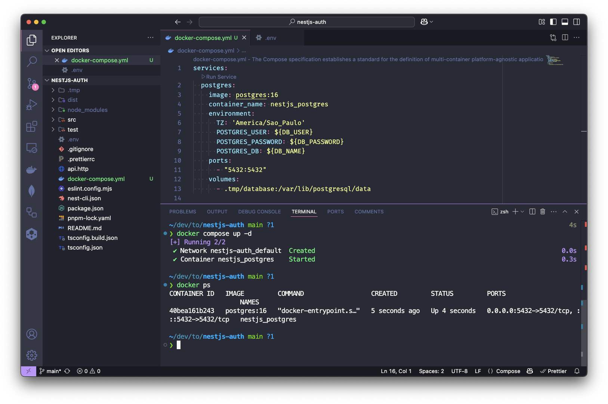
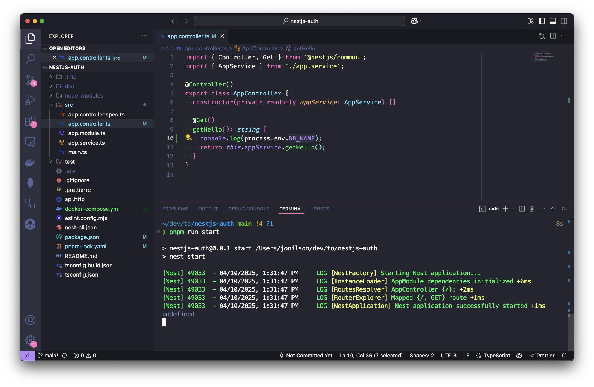
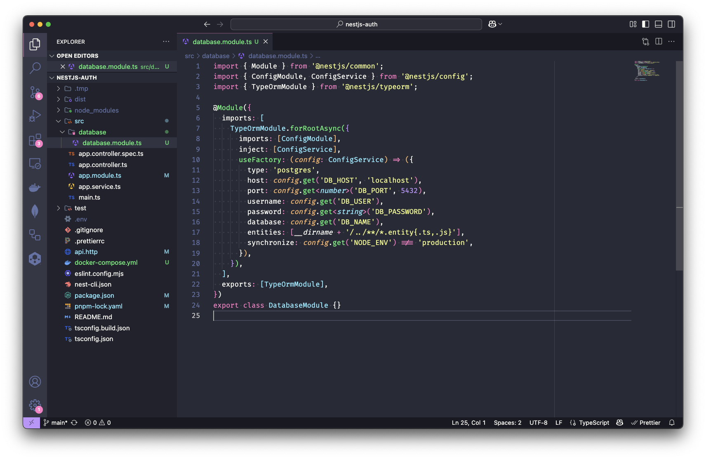

# NestJS: Persistência de Dados com PostgreSQL e TypeORM

Vamos dar continuidade a nossa série de artigos dominando o NestJS. Neste artigo, vamos aprender a subir um banco de dados PostgreSQL com Docker e configurar o TypeORM no NestJS. Vamos também aprender a usar o `@nestjs/config` para carregar as variáveis de ambiente do arquivo `.env` e disponibilizá-las na aplicação.

## Pré-requisitos

Você deve ter o projeto inicial do [artigo anterior](https://dev.to/jonilsonds9/introducao-ao-nestjs-criando-sua-primeira-aplicacao-1plh) para acompanhar o artigo. Caso não tenha feito isso, recomendo que você faça as etapas do artigo anterior antes de continuar.

## PostgreSQL com Docker Compose

Para facilitar o desenvolvimento, vamos usar o PostgreSQL no Docker. Para isso vamos precisar do Docker instalado na sua máquina. Caso não tenha o Docker instalado, você pode usar a [documentação oficial](https://docs.docker.com/engine/install/) para instalar.

Com o Docker instalado, crie um arquivo `docker-compose.yml` na raiz do seu projeto com o seguinte conteúdo:
```yaml
services:
 postgres:
   image: postgres:16
   container_name: nestjs_postgres
   environment:
     TZ: 'America/Sao_Paulo'
     POSTGRES_USER: ${DB_USER}
     POSTGRES_PASSWORD: ${DB_PASSWORD}
     POSTGRES_DB: ${DB_NAME}
   ports:
     - "5432:5432"
   volumes:
     - .tmp/database:/var/lib/postgresql/data
```

Certo, de forma proposital eu deixei variáveis de ambiente `DB_USER`, `DB_PASSWORD` e `DB_NAME` em vez de valores fixos. Isso é uma boa prática, pois permite que você altere esses valores sem precisar modificar o código. Além disso, você pode usar diferentes valores para diferentes ambientes (desenvolvimento, teste, produção, etc.).

Agora você pode criar um arquivo `.env` na raiz do seu projeto para adicionar as variáveis de ambiente para o Docker Compose bem como para o NestJS. Inicialmente, o arquivo `.env` deve conter as seguintes variáveis que precisamos para o Docker Compose:

```dotenv
DB_USER=postgres
DB_PASSWORD=postgres
DB_NAME=nestdb
```

Agora você pode iniciar o PostgreSQL com o Docker Compose. Execute o seguinte comando na raiz do seu projeto:
```shell
docker-compose up -d
```
Isso irá iniciar o PostgreSQL em segundo plano. Você pode verificar se o contêiner está em execução com o seguinte comando:
```shell
docker ps
```



Você pode acessar o PostgreSQL usando o cliente `psql` do Docker. Execute o seguinte comando para acessar o contêiner do PostgreSQL:
```shell
docker exec -it nestjs_postgres psql -U postgres -d nestdb
```
Isso irá abrir o cliente `psql` dentro do contêiner do PostgreSQL. Você pode executar comandos SQL normalmente. Para sair do cliente `psql`, digite `\q` ou `exit` e pressione Enter.

Um ponto importante é que por padrão o PostgreSQL usa a "trust authentication" que significa que não é necessário senha para acessar o banco de dados de forma local. Nesse caso, executamos o comando `psql` dentro do contêiner, e por isso não precisamos informar a senha. Já no caso da aplicação NestJS, precisamos informar a senha do banco de dados, já que a aplicação não está rodando dentro do contêiner e sim no nosso host.

## Instalação das dependências

O NestJS já tem um pacote `@nestjs/typeorm` para facilitar a integração com o TypeORM sem gerar sobrecarga. O TypeORM é um ORM (Object-Relational Mapping) mais maduro disponível para Typescript. Ele nos permite trabalhar com bancos de dados relacionais de forma mais fácil e intuitiva.

> Mas, poderíamos usar o Prisma, Sequelize ou qualquer outro ORM. O TypeORM é apenas uma opção que já vem integrada ao NestJS. Eu particularmente gosto do TypeORM, porque ele é `code-first`, ou seja, você escreve o código e ele gera o banco de dados para você diferente do Prisma que é `schema-first`, ou seja, você escreve o banco de dados e ele gera o código para você. Facilita a transição para alguém como eu que vem do mundo Java, onde o Hibernate é o ORM mais utilizado. Acho que a escolha do ORM depende muito do gosto pessoal e do projeto em si. O importante é escolher um ORM que atenda às suas necessidades e que você se sinta confortável em usar.

Para isso, vamos instalar o `@nestjs/typeorm`, junto com o `typeorm` de fato e driver do banco de dados que é pacote `pg`:
```shell
pnpm install @nestjs/typeorm typeorm pg
```

Podemos também já instalar o `bycrypt` para fazer o hash da senha do usuário que vamos cadastrar:
```shell
pnpm install @nestjs/jwt bcrypt
```
Também vamos instalar o `@types/bcrypt` para ter as definições de tipos do `bcrypt` para o TypeScript. Isso é importante para evitar erros de tipos e ter uma melhor experiência de desenvolvimento com o TypeScript. Para isso, execute o seguinte comando:
```shell
pnpm install --save-dev @types/bcrypt
```

## Configurando variáveis de ambiente no NestJS

Sabemos que as variáveis de ambiente são uma boa prática para manter as informações sensíveis fora do código-fonte. Isso é especialmente importante em projetos que podem ser executados em diferentes ambientes (desenvolvimento, teste, produção, etc.).

Em projeto Node.js, as variáveis de ambiente são acessadas através do objeto `process.env`, entretanto temos que configurar o **[dotenv](https://www.npmjs.com/package/dotenv)** para que as variáveis de ambiente sejam carregadas corretamente. Você pode testar adicionando o seguinte código no seu `app.controller.ts`:
```typescript
@Get()
 getHello(): string {
   console.log(process.env.DB_NAME);
   return this.appService.getHello();
 }
```
Ao executar a aplicação e acessar o http://localhost:3000, você verá que o valor de `DB_NAME` é `undefined`. Isso acontece porque o dotenv não está configurado para carregar as variáveis de ambiente do arquivo `.env`.



Para configurar as variáveis de ambiente no NestJS, vamos usar o pacote `@nestjs/config`. Esse pacote usa o **[dotenv](https://www.npmjs.com/package/dotenv)** internamente para carregar as variáveis de ambiente de um arquivo `.env` e disponibilizá-las na aplicação. Para instalar o pacote `@nestjs/config` use o seguinte comando:
```shell
pnpm install @nestjs/config
```

Atualmente nosso `app.module.ts` está com o seguinte código:
```typescript
import { Module } from '@nestjs/common';
import { AppController } from './app.controller';
import { AppService } from './app.service';

@Module({
 imports: [],
 controllers: [AppController],
 providers: [AppService],
})
export class AppModule {}
```

Agora vamos configurar o `ConfigModule` no nosso projeto. O `ConfigModule` é o módulo responsável por carregar as variáveis de ambiente e disponibilizá-las na aplicação. Para isso, vamos importar o `ConfigModule` no arquivo `app.module.ts` e configurar o `isGlobal` como `true`, dentro da lista de `imports` do `AppModule` para que as variáveis de ambiente fiquem disponíveis em toda a aplicação:
```typescript
import { Module } from '@nestjs/common';
import { AppController } from './app.controller';
import { AppService } from './app.service';
import { ConfigModule } from '@nestjs/config';

@Module({
 imports: [
   ConfigModule.forRoot({
     isGlobal: true,
   }),
 ],
 controllers: [AppController],
 providers: [AppService],
})
export class AppModule {}
```


## Configurando DatabaseModule com TypeORM

Agora que temos as variáveis de ambiente configuradas, podemos começar a configurar o TypeORM. Temos duas abordagens possíveis: Podemos usar `providers` e o TypeORM diretamente e deixar a configuração mais flexível, mas também mais complexa, verbosa e repetitiva, é útil quando temos mais de um banco de dados, ou contextos separados. Ou podemos usar o `TypeOrmModule` do `@nestjs/typeorm` que abstrai o TypeORM e o integra perfeitamente no ecossistema do NestJS, e também simplifica o acesso aos repositórios e descoberta de entidades e tudo mais. O que vamos fazer é usar o `TypeOrmModule` com `forRootAsync` e passar as configurações diretamente, mas usando o `ConfigService` para acessar as variáveis de ambiente.

Para isso, precisamos criar um módulo que vai conter a configuração do TypeORM. O que poderíamos fazer é importar o `TypeOrmModule` no `AppModule` e passar as configurações do banco de dados diretamente no `TypeOrmModule.forRoot()`, mas isso não é uma boa prática, pois o `AppModule` vai ficar muito grande e difícil de manter. Assim, vamos criar um módulo separado para o banco de dados. O NestJS tem um comando para criar módulos. Use o comando `generate` ou apenas `g` do NestJS CLI com a opção `module`:

```shell
nest g module database
```

O NestJS CLI vai criar a pasta `database` dentro da pasta `src` com o arquivo `database.module.ts`, onde vamos configurar o `TypeOrmModule` do `@nestjs/typeorm` e também importar o `DatabaseModule` no `AppModule`. O arquivo `database.module.ts` gerado deve ser:
```typescript
import { Module } from '@nestjs/common';

@Module({})
export class DatabaseModule {}
```

Agora vamos importar o `TypeOrmModule` e usar o `forRootAsync` dele para passar as configurações do banco de dados de forma assíncrona. Mas porque não usar o `forRoot`? E a resposta é que o `forRootAsync` é mais flexível e útil quando precisamos carregar as configurações de um arquivo `.env` ou cofres de segredos externos como AWS Secrets Manager, Azure Key Vault, etc. O `forRoot` é síncrono e pode não funcionar corretamente se as variáveis de ambiente não estiverem carregadas.

Também vamos usar o `ConfigService` do `@nestjs/config` para acessar as variáveis de ambiente do arquivo `.env`. O `ConfigService` é um serviço que já vem com o `@nestjs/config` e facilita o acesso às variáveis de ambiente, assim como conversão de valores e tudo mais.

> Poderíamos usar o `forRoot` do `TypeOrmModule`, mas isso não é uma boa prática, pois o `forRoot` é usado para passar as configurações de forma síncrona. O `forRootAsync` é mais flexível e permite que você carregue as configurações de forma assíncrona, que é o que queremos fazer com o `ConfigService` do  `ConfigModule`. Vamos usar o `ConfigService` para garantir que as variáveis de ambiente sejam carregadas corretamente quando a aplicação estiver pronta. O `ConfigService` é o serviço responsável por carregar as variáveis de ambiente do arquivo `.env` e disponibilizá-las na aplicação.

Vamos adicionar o `TypeOrmModule` no `imports` do `DatabaseModule` e usar o `forRootAsync` para passar as configurações do banco de dados. Precisamos agora dentro das configs do `TypeOrmModule` importar o `ConfigModule` e injetar o `ConfigService` para acessar as variáveis de ambiente. Por fim, vamos usar o `useFactory` para passar as configurações do banco de dados. O `useFactory` é uma função que retorna as configurações do banco de dados. O `useFactory` é chamado quando o módulo é carregado e o `ConfigService` já está disponível.

```typescript
import { Module } from '@nestjs/common';
import { ConfigModule, ConfigService } from '@nestjs/config';
import { TypeOrmModule } from '@nestjs/typeorm';

@Module({
 imports: [
   TypeOrmModule.forRootAsync({
     imports: [ConfigModule],
     inject: [ConfigService],
     useFactory: (config: ConfigService) => ({
       type: 'postgres',
       host: config.get('DB_HOST', 'localhost'),
       port: config.get<number>('DB_PORT', 5432),
       username: config.get('DB_USER'),
       password: config.get<string>('DB_PASSWORD'),
       database: config.get('DB_NAME'),
       entities: [__dirname + '/../**/*.entity{.ts,.js}'],
       synchronize: config.get('NODE_ENV') !== 'production',
     }),
   }),
 ],
 exports: [TypeOrmModule],
})
export class DatabaseModule {}
```

Veja que o `ConfigService` já está injetado no `useFactory` e podemos acessar as variáveis de ambiente através do método `get()`. O método `get()` recebe o nome da variável de ambiente e um valor padrão caso a variável não esteja definida. O `ConfigService` já faz a conversão do tipo para o tipo desejado através do generics.

**Todas as configurações são bastante autoexplicativas, mas vamos destacar duas**:

- **`entities`**: Array que contém os caminhos para as entidades do TypeORM. O `__dirname` é uma variável global do Node.js que contém o caminho do diretório atual. O `+ '/../**/*.entity{.ts,.js}'` é um padrão que indica que queremos carregar todas as entidades que terminam com `.entity.ts` ou `.entity.js` dentro do diretório pai (no caso o diretório `src`) e em todos seus subdiretórios.

- **`synchronize`**: Opção que faz com que o TypeORM sincronize o banco de dados com as entidades sempre que a aplicação for iniciada. Isso é útil para desenvolvimento, mas **não é recomendado para produção**. Nesse caso, estamos usando a variável de ambiente `NODE_ENV` para verificar se não estamos em produção. Se o `NODE_ENV` for diferente de `production`, o `synchronize` será `true`, caso contrário será `false`. Isso significa que o banco de dados será sincronizado apenas em desenvolvimento ou testes. Em produção, você deve usar `migrations` para atualizar o banco de dados.



> Lembre-se de adicionar a variável de ambiente `NODE_ENV` no arquivo `.env` para que o TypeORM saiba em qual ambiente está rodando. Para isso, adicione a seguinte linha no arquivo `.env`:
> ```dotenv
> NODE_ENV=development
>
> DB_USER=postgres
> DB_PASSWORD=postgres
> DB_NAME=nestdb
> ```

Agora tudo pronto! Você pode subir a aplicação e tudo deve funcionar normalmente. Mas como saber se a conexão com o banco está funcionando? Podemos apenas trocar uma das variáveis de ambiente, por exemplo, alterar a variável `DB_NAME` no arquivo `.env` para um nome de banco de dados que não existe. Ao subir a aplicação, o TypeORM deve dar um erro de conexão e a aplicação não vai subir.

### Conclusão

Neste artigo, aprendemos a configurar o TypeORM com o PostgreSQL no NestJS. Também aprendemos a usar o `ConfigModule` para carregar as variáveis de ambiente do arquivo `.env` e disponibilizá-las na aplicação. Por hoje é isso, mas não se preocupe, ainda temos muito mais pela frente!
