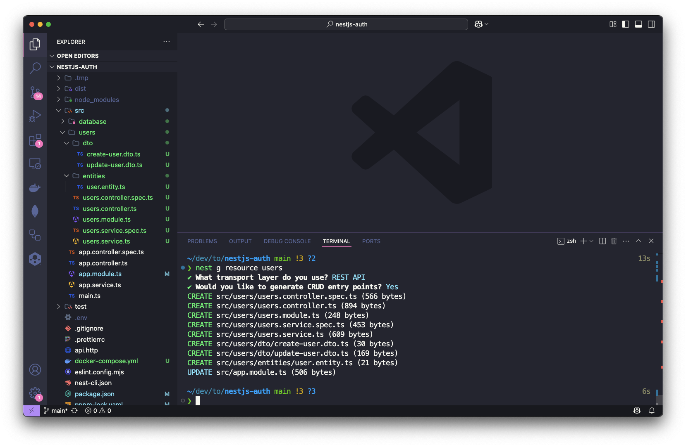
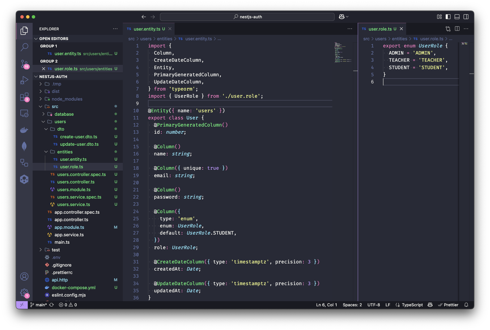
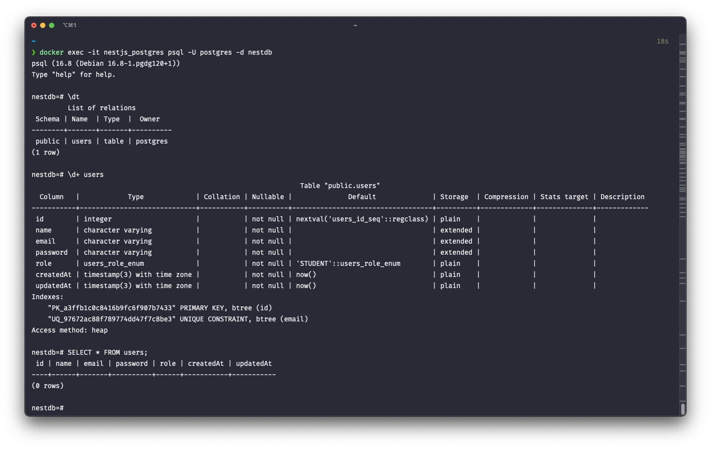
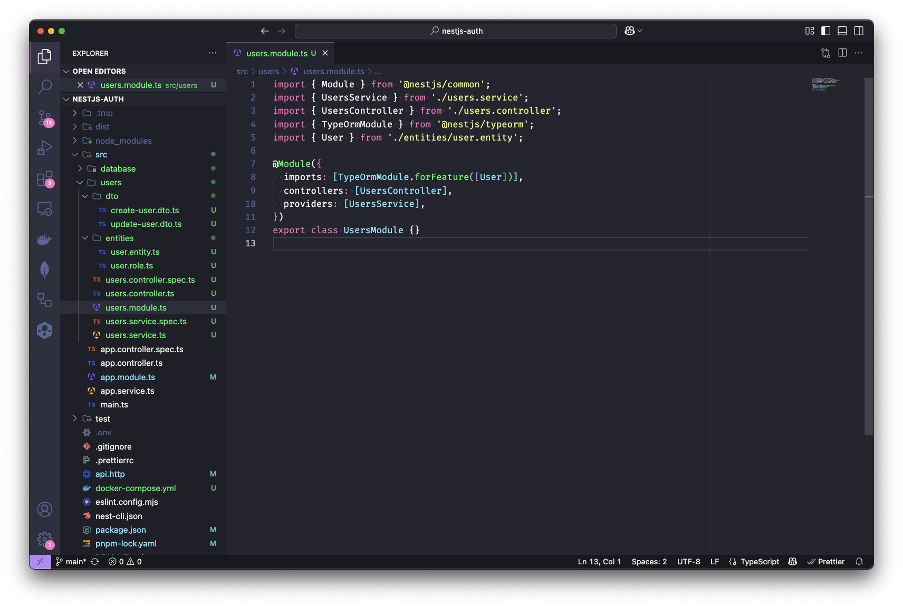
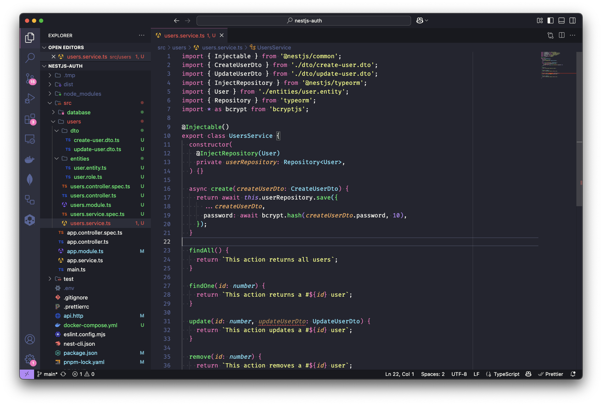
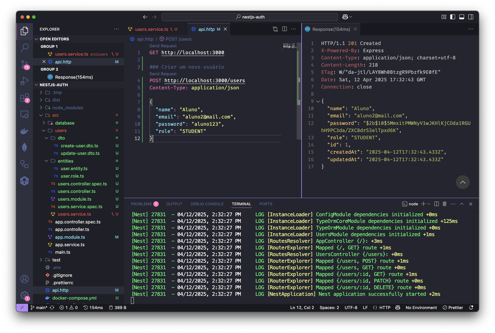
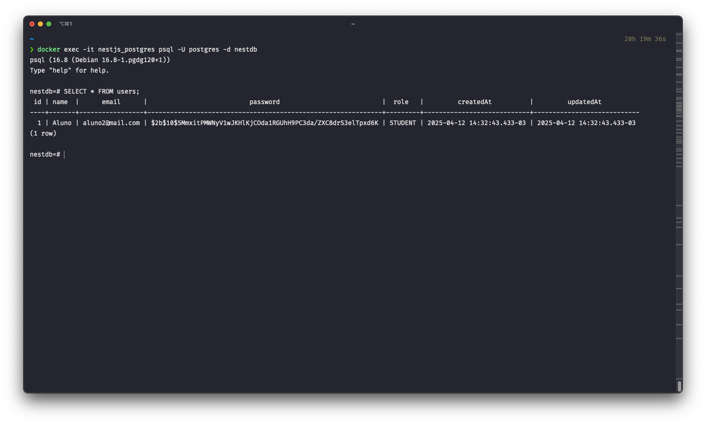

# NestJS: Construindo o Módulo de Usuário — Parte 1: Salvando no banco

Continuando nossa série de artigos dominando o NestJS, hoje vamos aprender a criar um módulo de usuários, que é um dos módulos mais importantes em uma aplicação, pois é responsável por gerenciar os usuários da aplicação. Neste artigo, vamos aprender a criar o módulo e salvar um usuário no banco de dados usando o `bcrypt` para fazer o hash da senha do usuário.

### Módulo de usuários

Para fazer a autenticação precisamos de usuários. Sendo assim, precisamos de uma entidade de usuário, bem como um `controller` para gerenciar as requisições e um `service` para gerenciar a lógica de gestão dos usuários, também precisamos de um `module`, DTOs e tudo mais, é bastante coisa. Poderíamos então criar uma pasta `users` dentro da pasta `src` e criar os arquivos `user.entity.ts`, `users.controller.ts`, `users.service.ts`, `users.module.ts`. Mas o NestJS CLI já tem um comando para criar o módulo, com todos os componentes básicos necessários e com um comando vamos ganhar produtividade e velocidade. Para isso, basta executar comando `generate` ou apenas `g` do NestJS CLI:

```shell
nest g resource users
```

Quando você executar o comando acima o NestJS CLI vai fazer algumas perguntas:

- **What transport layer do you use**: Responda `REST API` que é o que vamos usar.
- **Would you like to generate CRUD entry points**: Responda `Y` para sim, para que ele crie os métodos básicos de CRUD.

Agora, o NestJS CLI vai criar a pasta `users` dentro da pasta `src` com os seguintes arquivos:
```shell
nestjs-auth/
├── src/
│   ├── users/
│   │   ├── dto/
│   │   │   ├── create-user.dto.ts
│   │   │   ├── update-user.dto.ts
│   │   ├── entities/
│   │   │   └── user.entity.ts
│   │   ├── users.controller.spec.ts
│   │   ├── users.controller.ts
│   │   ├── users.module.ts
│   │   ├── users.service.spec.ts
│   │   └── users.service.ts
│   ├── ...
```



O NestJS CLI gerou automaticamente os arquivos de teste e integrou o `UsersModule` ao `AppModule`. O próximo passo é configurar a tabela de usuários no banco de dados. No TypeORM, utilizamos entidades para esta finalidade - classes decoradas com `@Entity()` que representam tabelas no banco. Este framework aproveita os decoradores do TypeScript para realizar o mapeamento entre classes e estruturas do banco de dados.

Precisamos adicionar o decorator `@Entity()` à classe `User` gerada automaticamente. Embora o NestJS CLI tenha criado o arquivo `user.entity.ts`, ele não incluiu este decorator necessário. Para configurar corretamente a entidade, o arquivo deve ser estruturado assim:

```typescript
import { Entity } from 'typeorm';

@Entity({ name: 'users' })
export class User {}
```

O decorator `@Entity()` recebe um objeto com diversas propriedades opcionais, eu gosto de usar a propriedade `name` para definir o nome da tabela no banco de dados. O TypeORM por padrão usa o nome da classe todo em maiúsculo como nome da tabela (`user`), mas `user` passa a ideia de apenas um usuário, o que não faz muito sentido já que a tabela vai conter vários usuários. Por isso, eu gosto de usar o plural `users` como nome da tabela.

Certo, mas ainda não temos nenhuma coluna. Para isso, precisamos adicionar as propriedades que queremos que sejam colunas na tabela. Vamos adicionar as propriedades `id`, `name`, `email` e `password` na classe `User`. A propriedade `id` vai ser a chave primária da tabela, então precisamos adicionar o decorator `@PrimaryGeneratedColumn()` do TypeORM, que já faz o mapeamento da propriedade `id` como chave primária e também gera o valor automaticamente:

```typescript
import { Column, Entity, PrimaryGeneratedColumn } from 'typeorm';

@Entity({ name: 'users' })
export class User {
  @PrimaryGeneratedColumn()
  id: number;
}
```

As demais colunas são mapeadas usando o decorator `@Column()`, que vincula propriedades da classe às colunas correspondentes na tabela. O TypeORM mantém o mesmo nome da propriedade ao criar a coluna no banco de dados. Este decorator aceita um objeto opcional de configuração com opções como `type`, `nullable`, `unique` e `default`. Por padrão, o TypeORM infere automaticamente o tipo da coluna baseado na propriedade - por exemplo, para propriedades do tipo `string`, ele cria uma coluna `varchar(255)` (dependendo do banco de dados). No entanto, é possível especificar explicitamente o tipo desejado através das configurações do decorator.

Agora vamos adicionar as propriedades `name`, `email`, `password` e `role` como colunas da tabela.  `name`, `password` são apenas string, sendo assim não precisamos passar o tipo explicitamente. O TypeORM vai inferir o tipo da coluna a partir do tipo da propriedade. Já a coluna `email` é uma string, mas queremos que seja única na tabela, então vamos passar a propriedade `unique` no decorator para garantir que não haja dois usuários com o mesmo email. O TypeORM vai criar um índice único na coluna `email`, o que garante que não haja duplicidade.

Também vamos adicionar a propriedade `role` que vai ser um enum, para isso vamos criar um arquivo `user.role.ts` na pasta `src/users/entities` por enquanto, e vamos criar um enum `UserRole` com o seguinte código:

```typescript
export enum UserRole {
 ADMIN,
 INSTRUCTOR,
 STUDENT,
}
```

O enum `UserRole` vai conter os valores `ADMIN`, `INSTRUCTOR` e `STUDENT`, que representam os papéis do usuário. Para isso, vamos adicionar a propriedade `role` na classe `User` e vamos passar o tipo `enum` para o decorator `@Column()`, também podemos passar o valor padrão `STUDENT` para a coluna `role`, assim todos os usuários que forem criados vão ter o papel de estudante por padrão.

Agora, o arquivo `user.entity.ts` vai ficar assim:

```typescript
import { Column, Entity, PrimaryGeneratedColumn } from 'typeorm';
import { UserRole } from './user.role';

@Entity({ name: 'users' })
export class User {
 @PrimaryGeneratedColumn()
 id: number;

 @Column()
 name: string;

 @Column({ unique: true })
 email: string;

 @Column()
 password: string;

 @Column({
   type: 'enum',
   enum: UserRole,
   default: UserRole.STUDENT,
 })
 role: UserRole;
}
```

Para finalizar, é interessante ter o momento em que o usuário foi criado e atualizado. Para isso, podemos adicionar as propriedades `createdAt` e `updatedAt` na classe `User`. O TypeORM tem os decorators `@CreateDateColumn()` e `@UpdateDateColumn()` que fazem isso automaticamente. O decorator `@CreateDateColumn()` vai adicionar a data de criação do usuário e o decorator `@UpdateDateColumn()` vai adicionar a data de atualização do usuário. Esses decorators vão criar as colunas `createdAt` e `createdAt` no banco de dados.

Tanto o decorator `@CreateDateColumn()` quanto o `@UpdateDateColumn()` não tem nenhum parâmetro obrigatório. Por padrão, o TypeORM vai criar as colunas como `timestamp` no banco de dados, no caso do PostgreSQL, o tipo `timestamp` é o mesmo que `timestamp without time zone`, ou seja, ele vai armazenar a data e hora sem o fuso horário e com precisão de 6 dígitos nos microssegundos, um exemplo de valor é `2024-10-17 14:35:22.123456`. Então podemos passar `{ type: 'timestamptz', precision: 3 }` para esses decorators, para que o TypeORM crie as colunas como `timestamp with time zone`, com fuso horário e precisão de 3 dígitos nos milissegundos que já é o suficiente, um exemplo de valor é `2024-10-17 14:35:22.123-03`. Com tudo isso a nossa classe `User` deve ficar assim:

```typescript
import {
  Column,
  CreateDateColumn,
  Entity,
  PrimaryGeneratedColumn,
  UpdateDateColumn,
} from 'typeorm';
import { UserRole } from './user.role';

@Entity({ name: 'users' })
export class User {
  @PrimaryGeneratedColumn()
  id: number;

  @Column()
  name: string;

  @Column({ unique: true })
  email: string;

  @Column()
  password: string;

  @Column({
    type: 'enum',
    enum: UserRole,
    default: UserRole.STUDENT,
  })
  role: UserRole;

  @CreateDateColumn({ type: 'timestamptz', precision: 3 })
  createdAt: Date;

  @UpdateDateColumn({ type: 'timestamptz', precision: 3 })
  updatedAt: Date;
}
```



Agora, quando você subir a aplicação, o TypeORM vai criar a tabela `users` no banco de dados com as colunas `id`, `name`, `email`, `password` e `role`. Você pode verificar isso acessando o banco de dados:



### Criando o repositório de usuários

O TypeORM suporta o padrão de repositório, assim cada entidade tem um repositório associado a ela. O repositório é responsável por fazer as operações de CRUD (Create, Read, Update e Delete) no banco de dados e podemos conseguir o repositório através do `TypeOrmModule` que já registramos no `DatabaseModule`. O repositório é uma abstração que facilita o acesso ao banco de dados e permite que você trabalhe com as entidades de forma mais fácil e intuitiva.

O repositório é uma classe que estende a classe `Repository` do TypeORM e tem métodos para fazer as operações de CRUD no banco de dados. O repositório é injetado no `service` e pode ser usado para fazer as operações de CRUD. Agora que temos a tabela de usuários criada, precisamos criar o repositório de usuários. O TypeORM já tem um repositório padrão que podemos usar, mas também podemos criar um repositório personalizado se quisermos.

Para isso, precisamos importar o `TypeOrmModule` no `UsersModule` e usar o método `forFeature()` para registrar o repositório de usuários. O método `forFeature()` recebe um array com as entidades (`[User]`) que queremos registrar no escopo atual, isso significa que o repositório de usuários só estará disponível no `UsersModule` e não em outros módulos da aplicação. Nosso `users.module.ts` deve ficar assim:

```typescript
import { Module } from '@nestjs/common';
import { UsersService } from './users.service';
import { UsersController } from './users.controller';
import { TypeOrmModule } from '@nestjs/typeorm';
import { User } from './entities/user.entity';

@Module({
  imports: [TypeOrmModule.forFeature([User])],
  controllers: [UsersController],
  providers: [UsersService],
})
export class UsersModule {}
```



Agora já temos o repositório de usuários registrado no `UsersModule`. O repositório de usuários pode ser injetado no `UsersService` e pode ser usado para fazer as operações no banco de dados. O repositório é injetado através do construtor do `UsersService`. Para isso, precisamos importar o `InjectRepository` do `@nestjs/typeorm` e o `Repository` do `typeorm`. O `InjectRepository` é um decorator que indica que queremos injetar  um repositório, temos que passar como argumento o tipo do repositório que queremos injetar, no caso a entidade `User`. O `Repository` é a classe base do TypeORM para trabalhar com entidades, e precisamos indicar o tipo da entidade que queremos trabalhar, no caso `User` usando o generics, ou seja, `Repository<User>`. O `UsersService` deve ficar assim:

```typescript
import { Injectable } from '@nestjs/common';
import { InjectRepository } from '@nestjs/typeorm';
import { User } from './entities/user.entity';
import { Repository } from 'typeorm';

@Injectable()
export class UsersService {
 constructor(
    @InjectRepository(User)
    private userRepository: Repository<User>,
 ) {}

  // Métodos do service
}
```

Agora temos o repositório de usuários injetado no `UsersService` e podemos usar os métodos do repositório para fazer as operações no banco de dados. O repositório já tem os métodos básicos de CRUD prontos para serem usados, como `find()`, `findOne()`, `save()`, `update()`, `delete()`, entre outros.

### Salvando usuários no banco de dados

Finalmente podemos começar a implementar os métodos do `UsersService`. O primeiro método que vamos implementar é o método de criar usuário `create()`. Este método recebe um DTO (Data Transfer Object) que representa os dados que queremos enviar a requisição para criar um usuário. Mas esse `CreateUserDto` está vazio, então precisamos adicionar as propriedades que queremos que sejam enviadas na requisição para criar um usuário. O DTO deve conter as propriedades `name`, `email`, `password` e `role`. O `role` é um enum que representa o papel do usuário, então vamos usar o enum `UserRole` que criamos anteriormente.

Abra o arquivo `create-user.dto.ts` que foi criado pelo NestJS CLI e adicione as propriedades:

```typescript
import { UserRole } from '../entities/user.role';

export class CreateUserDto {
 name: string;
 email: string;
 password: string;
 role: UserRole;
}
```

> Não se preocupe com a validação dos dados agora, vamos fazer no próximo artigo. Dando spoiler, vamos usar o pacote chamado `class-validator` para validar os dados do DTO.

Agora podemos implementar o método `create()` no `UsersService` corretamente. O método `create()` recebe um `CreateUserDto` e usa o repositório de usuários para salvar o usuário no banco de dados. O método `save()` do repositório salva o usuário. O método `create()` deve ficar assim:

```typescript
async create(createUserDto: CreateUserDto) {
 return await this.userRepository.save({
    ...createUserDto,
    password: bcrypt.hashSync(createUserDto.password, 10),
 });
}
```

Aqui estamos usando o operador de espalhamento (`...`) para copiar as propriedades do `createUserDto` para um novo objeto. Isso é útil para evitar a mutação do objeto original e criar um novo objeto com as propriedades que queremos. E também fazemos o hash da senha do usuário para salvar o hash no banco em vez da senha em texto plano. Veja também que trocamos o método `create()` do service para `async create()`, isso porque o método `save()` do repositório é assíncrono e precisamos esperar o resultado. O método `create()` retorna o usuário criado no banco de dados.

O método `save()` do repositório recebe um objeto que representa o usuário que queremos salvar no banco de dados. O TypeORM vai mapear o objeto para a entidade `User` e salvar no banco de dados. O método `save()` retorna o usuário salvo no banco de dados, ou seja, o usuário com o id gerado pelo banco de dados.

O `bcrypt.hashSync()` é usado para fazer o hash da senha do usuário antes de salvar no banco de dados. O `bcrypt` é um algoritmo de hash que é usado para proteger senhas. O método `hashSync()` recebe a senha e o número de rounds ou salt (10) que é o custo do hash. O número de rounds indica quantas vezes o algoritmo vai fazer o hash da senha, quanto maior o número de rounds, mais seguro é o hash, mas também mais lento. O padrão é 10, mas você pode aumentar se quiser mais segurança.

Não se esqueça de importar o `bcrypt` no arquivo `users.service.ts`:

```typescript
// Outros imports

import * as bcrypt from 'bcrypt';
```


> Sim, estamos retornando o hash da senha do usuário, **NÃO FAÇA ISSO EM PRODUÇÃO**, pois estamos expondo o hash da senha. O ideal seria retornar apenas o usuário criado sem a senha. Mas para simplificar, vamos deixar assim por enquanto. No próximo artigo vamos implementar a validação dos dados e também vamos usar o `class-transformer` para transformar o objeto antes de retornar.

### Problema com o bcrypt

Ao tentar usar o `bcrypt`, você pode se deparar com o seguinte erro:
```shell
Cannot find module '.../bcrypt/lib/binding/napi-v3/bcrypt_lib.node'
```
Usuários do Node.js em versões recentes (como a v22.14.0) podem encontrar incompatibilidades com o `bcrypt`. Isso ocorre porque a biblioteca depende de binários pré-compilados que podem não estar disponíveis para as últimas atualizações do Node.

Uma alternativa é utilizar o `bcryptjs`, uma implementação em JavaScript puro que não requer binários pré-compilados. Para fazer a migração, remova o `bcrypt` e `@types/bcrypt` do seu projeto e instale o `bcryptjs`:

```shell
pnpm remove bcrypt @types/bcrypt
pnpm install bcryptjs
```

A transição é simples, pois o `bcryptjs` mantém compatibilidade com a API original. Apenas atualize a importação em seu código:

```typescript
import * as bcrypt from 'bcryptjs';
```



Vale ressaltar que esta biblioteca já inclui suporte nativo ao TypeScript, dispensando instalações adicionais de tipos. Porém, conforme a documentação oficial, existe um trade-off: apesar da maior compatibilidade, o `bcryptjs` apresenta performance cerca de 30% inferior à versão original:

> While bcrypt.js is compatible to the C++ bcrypt binding, it is written in pure JavaScript and thus slower (about 30%), effectively reducing the number of iterations that can be processed in an equal time span.

Você pode voltar a usar o `bcrypt` quando o mesmo for atualizado para suportar as versões mais recentes do Node.js.

### Testando o método `create()`

Agora que temos o método `create()` do `UsersService` implementado, podemos testar se ele está funcionando corretamente. Como o NestJS já criou o `UsersController` e implementou os métodos básicos de CRUD, podemos apenas adicionar uma nova request `POST` no `api.http` na raiz do projeto com o seguinte conteúdo:

```http
### Criar usuário
POST http://localhost:3000/users
Content-Type: application/json

{
 "name": "Aluno",
 "email": "aluno1@mail.com",
 "password": "aluno123",
 "role": "STUDENT"
}
```



Executar a requisição. Você deve receber um status `201 Created` e o usuário criado no banco de dados. Você pode verificar isso acessando o banco de dados e executando o seguinte comando:

```sql
SELECT * FROM users;
```



### Conclusão

Neste artigo, começamos a criar um módulo de usuários com o NestJS para salvar um usuário no banco de dados. Também aprendemos a usar o `bcrypt` para fazer o hash da senha do usuário antes de salvar no banco de dados. Por hoje é só, até o próximo artigo!
