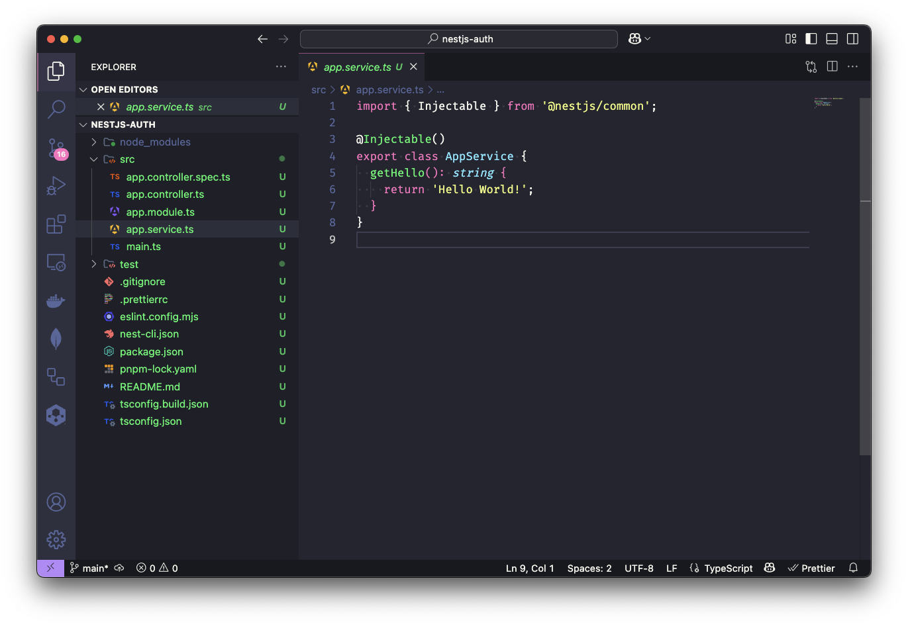

# Introdução ao NestJS: Criando sua primeira aplicação

Neste artigo, vamos ter uma visão geral do que é o NestJS, como ele funciona, por que você deve usá-lo e como criar sua primeira aplicação com este poderoso framework. E não se preocupe, não vamos ter muita enrolação, vamos direto ao ponto!

Este artigo é o primeiro da série "Dominando o NestJS", onde exploramos os principais conceitos e funcionalidades do framework, além de criar projetos práticos.

## O que é o NestJS?

O NestJS é um framework para construir aplicações Node.js escaláveis e eficientes, utilizando TypeScript. Construído sobre o Express, ele traz uma arquitetura modular, facilitando a organização e manutenção do código.

Inspirado em conceitos de programação orientada a objetos, funcional e reativa, o NestJS é altamente extensível e permite integração com bibliotecas e ferramentas populares.

## Por que usar o NestJS?

A resposta é simples: **Produtividade e escalabilidade**. O NestJS oferece uma estrutura sólida e organizada para o desenvolvimento de aplicações, permitindo que você se concentre na lógica de negócios enquanto o framework cuida da parte estrutural. Com isso, você pode começar a desenvolver componentes reutilizáveis, facilitando a manutenção e a evolução do código.

O NestJS também possui suporte nativo para TypeScript, o que traz benefícios como tipagem forte e melhor experiência no desenvolvimento. Com isso, podemos usar um linter e/ou Prettier para padronizar e manter o código limpo, facilitando para que outros desenvolvedores entendam e colaborem no projeto.

A comunidade do NestJS é bastante ativa e está em crescimento. Você pode entrar diretamente no servidor do [Discord](https://discord.gg/G7Qnnhy) do NestJS e tirar suas dúvidas com outros desenvolvedores. Ele também possui uma [documentação](https://docs.nestjs.com/) completa e bem estruturada, o que facilita o aprendizado e a adoção do framework.

Também é possível integrar o NestJS com outras tecnologias, como bancos de dados relacionais e não relacionais, filas de mensagens, autenticação, testes automatizados, entre outros. Isso torna o NestJS uma excelente escolha para projetos de todos os tamanhos e complexidades.

## O que você vai aprender nesta série?

Nesta série, vamos explorar os principais conceitos e funcionalidades do NestJS, de forma prática e objetiva. Então, vamos entender e utilizar os seguintes recursos:

- **Módulos**: Classe anotada com o decorator `@Module`, que fornece metadados para organizar e gerenciar a estrutura do aplicativo.
- **Controladores**: Cria rotas e manipula requisições HTTP, manipula parâmetros de rota, query strings e corpo das requisições.
- **Serviços**: Contém a lógica de negócios da aplicação, pode ser utilizado para injetar serviços em controladores e em outros serviços.
- **Injeção de dependência**: Facilita o gerenciamento de dependências entre componentes.
- **Middleware**: Intercepta requisições e respostas, permitindo adicionar diversas funcionalidades, entre outras.
- **Pipes**: Transformam e validam dados de entrada, permitindo garantir que os dados recebidos estejam no formato correto.
- **Guards**: Protegem rotas e recursos, permitindo implementar autenticação e autorização.
- **Decorators**: Adicionam metadados a classes e métodos, facilitando a configuração de rotas, validação de dados, entre outros.
- **Suporte a tecnologias**: Integração com bancos de dados, autenticação, filas, testes automatizados, entre outros.

## Pré-requisitos

Chega de blá blá blá, vamos colocar a mão na massa! Primeiro de tudo, vamos aos pré-requisitos. Para seguir esta série, você precisa ter conhecimentos básicos de **JavaScript** e **TypeScript**, além de noções de desenvolvimento **APIs RESTful**.
E, claro, você deve ter o Node.js instalado na sua máquina.

**1. Instalação do Node.js com NVM**

Você pode baixar a versão mais recente do Node.js [aqui](https://nodejs.org), recomendo usar o Node.js LTS (Long Term Support), que é a versão mais estável e recomendada para a maioria dos usuários.

Você também pode usar o [**NVM** (Node Version Manager)](https://github.com/nvm-sh/nvm) para gerenciar as versões do Node.js na sua máquina e facilitar a sua vida no futuro. O NVM permite instalar e alterar entre diferentes versões do Node.js com facilidade. Para saber sobre a instalação do NVM, veja a [documentação oficial](https://github.com/nvm-sh/nvm?tab=readme-ov-file#installing-and-updating). Com o NVM instalado, você pode instalar a versão mais recente do Node.js com o seguinte comando:
```shell
nvm install --lts
```

Se você tem mais de uma versão do Node.js instalada, você pode dizer ao NVM qual versão usar com o seguinte comando:
```shell
nvm use --lts
```

Ou definir uma versão padrão para o NVM usar sempre que você abrir um novo terminal:
```shell
nvm alias default <versão>
```

Agora, se você executar o comando `node -v`, você verá a versão do Node.js instalada na sua máquina.

**2. Instalação do PNPM**

Recomendo usar o [**PNPM**](https://pnpm.io/) como gerenciador de pacotes, pois ele é mais rápido e eficiente do que o NPM e o Yarn. Como esse assunto foge um pouco do escopo deste artigo, não vou entrar em detalhes sobre o PNPM, mas você pode ler mais sobre ele na [documentação oficial](https://pnpm.io/pt/motivation).

No caso do macOS, você pode instalar o PNPM com o Homebrew, que é um gerenciador de pacotes para o macOS com o seguinte comando:
```shell
brew install pnpm
```
Se você estiver usando outro sistema operacional ou não quiser usar o Homebrew, você pode dar uma olhada na [documentação de instalação do PNPM](https://pnpm.io/pt/installation) para ver todas as opções de instalação.

Você também precisa fazer o setup do PNPM com o seguinte comando:
```shell
pnpm setup
```

**3. Instalação do NestJS CLI**

O NestJS CLI é uma ferramenta de linha de comando que facilita a criação e gerenciamento de projetos NestJS. Com ele, você pode criar novos projetos, gerar componentes, executar testes, entre outras funcionalidades. Agora que você tem o Node.js e o PNPM instalados, você pode instalar o NestJS CLI globalmente com o seguinte comando:
```shell
pnpm add -g @nestjs/cli
```
Você deve ter o seguinte resultado:


Você pode verificar se o NestJS CLI foi instalado corretamente executando o seguinte comando:
```shell
nest --version
```
Se tudo estiver certo, você verá a versão do NestJS CLI instalada na sua máquina.

**4. VSCode e Extensões**

Se, assim como eu, você é fã do Visual Studio Code, recomendo instalar as seguintes extensões para facilitar o desenvolvimento com o NestJS:

- [**ESLint**](https://marketplace.visualstudio.com/items?itemName=dbaeumer.vscode-eslint): Extensão para linting de código JavaScript e TypeScript.
- [**Prettier**](https://marketplace.visualstudio.com/items?itemName=esbenp.prettier-vscode): Extensão para formatação de código.
- [**REST Client**](https://marketplace.visualstudio.com/items?itemName=humao.rest-client): Extensão para fazer requisições HTTP diretamente do VSCode.

## Criando sua primeira aplicação com o NestJS

Agora que você tem o NestJS CLI instalado, vamos criar sua primeira aplicação com o NestJS. Para isso, execute o seguinte comando:
```shell
nest new nome-do-seu-projeto
```
No meu caso, vou criar um projeto chamado `nestjs-auth`:
```shell
nest new nestjs-auth
```
O NestJS CLI perguntará qual gerenciador de pacotes você deseja usar. Escolha o PNPM e pressione Enter.


Ao final do processo, que é bem rápido com o PNPM, você verá uma mensagem informando que o projeto foi criado com sucesso:


Após a criação do projeto, entre na pasta do projeto:
```shell
cd nestjs-auth
```
Abra no seu editor de código preferido. Vou usar o Visual Studio Code.


## Estrutura do projeto

A estrutura do projeto criada pelo NestJS CLI é a seguinte:
```
nestjs-auth/
├── node_modules/
├── src/
│   ├── app.controller.spec.ts
│   ├── app.controller.ts
│   ├── app.module.ts
│   ├── app.service.ts
│   ├── main.ts
├── test/
├── .gitignore
├── .prettierrc
├── eslint.config.mjs
├── nest-cli.json
├── package.json
├── pnpm-lock.yaml
├── README.md
├── tsconfig.build.json
├── tsconfig.json
```

- `src/`: Onde fica o código fonte da aplicação:
 - `app.controller.spec.ts`: Arquivo de teste do controlador raiz da aplicação. Ele é responsável por testar o controlador.
 - `app.controller.ts`: Controlador raiz da aplicação. Ele é responsável por lidar com as requisições HTTP e retornar as respostas.
 - `app.module.ts`: Módulo raiz da aplicação. Ele é responsável por importar e configurar os demais módulos, controladores e serviços da aplicação.
 - `app.service.ts`: Serviço raiz da aplicação. Ele é responsável por conter a lógica de negócios da aplicação.
 - `main.ts`: Ponto de entrada da aplicação. Ele é responsável por iniciar o servidor e carregar o módulo raiz da aplicação usando o `NestFactory`.
- `test/`: Onde ficam os testes da aplicação, focados em testes de integração e E2E.
- `.gitignore`: Arquivo de configuração do Git. Ele contém os arquivos e pastas que devem ser ignorados pelo Git.
- `.prettierrc`: Arquivo de configuração do Prettier. Ele contém as regras de formatação do código e pode ser JSON ou YAML.
- `eslint.config.mjs`: Arquivo de configuração do ESLint. Ele contém as regras de linting do código.
- `nest-cli.json`: Arquivo de configuração do NestJS CLI. Ele contém as configurações do projeto, como o diretório de saída dos arquivos compilados.
- `package.json`: Arquivo de configuração do projeto. Ele contém as dependências, scripts e configurações do projeto.
- `pnpm-lock.yaml`: Arquivo de bloqueio do PNPM. Ele contém as versões exatas das dependências instaladas no projeto, garantindo que todos os desenvolvedores utilizem as mesmas versões.
- `README.md`: Arquivo de documentação do projeto. Ele contém informações sobre o projeto, como instalar, executar e contribuir.
- `tsconfig.build.json`: Esse arquivo estende o `tsconfig.json` e contém as configurações específicas para a construção (build) do projeto. Com isso, ele adiciona ou sobrescreve algumas configurações do tsconfig.json para a construção do projeto
- `tsconfig.json`: Arquivo de configuração do TypeScript. Ele contém as configurações do compilador TypeScript, como o diretório de saída dos arquivos compilados e as opções de compilação.

## Executando a aplicação

O Nest CLI cria o projeto com um `AppController` que é responsável por lidar com as requisições HTTP na rota raiz `/`. Ele invoca o método `getHello()` do serviço `AppService`:


O `AppService` possui um método `getHello()` que retorna uma string `"Hello World!"` que é retornada pelo `AppController`:



Para executar a aplicação, você pode usar o seguinte comando:
```shell
pnpm run start
```

Pronto, a aplicação deve estar rodando na porta 3000. Você pode acessar a aplicação no seu navegador através do endereço http://localhost:3000 ou usar o [**REST Client**](https://marketplace.visualstudio.com/items?itemName=humao.rest-client) do VSCode para fazer uma requisição GET para a rota raiz `/`. Para isso crie um arquivo `api.http` na raiz do projeto com o seguinte conteúdo:

```http
GET http://localhost:3000/
```

E clique no botão `Send Request` que aparece acima da requisição. Você deve ver o seguinte resultado:


## Próximos passos

Agora que você já tem sua primeira aplicação rodando, você pode começar a explorar os principais conceitos e funcionalidades do NestJS. Lembre-se de enviar seu projeto para o repositório remoto como o GitHub ou GitLab.

> Lembre-se de que vamos utilizar esse projeto ou criar novos projetos durante a série.

## Conclusão

Neste artigo, você aprendeu o que é o NestJS, por que usá-lo e como criar sua primeira aplicação. Também vimos a estrutura do projeto criado pelo NestJS CLI e como executar a aplicação. Por hoje é só, mas não se preocupe, ainda temos muito mais pela frente!
